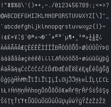

# Vanilla Mono
A bitmap, monospace font designed for coding.

Supports most latin characters:  

Made using www.pentacom.jp/pentacom/bitfontmaker2/.
I'm not sure which character set it uses (maybe ASCII-extended?), but I made every glyph in the default map.

Has to be set to exactly 16px or the font will be blurry. I guess that's just how bitmap fonts are \\/('~')\\/.
